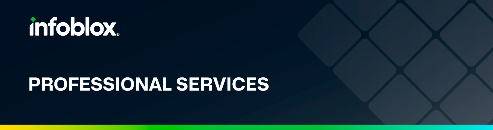

# ibx-tools
Basic Tools and Functions used by other Integrations.

# Base Toolkit
## ibx-tools
- NIOS funtions
	- wapi api wrapper
	- fileop
	- services
- Logger functions
- utilities functions
- Scripts Folder
	- nios-log
	- nios-supportbundle
	- nios-backup
	- nios-restart-services
	- nios-csvimport
	- nios-csvexport
## License Type
- Perhaps MIT

## Code Review
- Find and remove any IP
- Googledoc Strings accross all methods
- Exception handling
- Clean up maintainer emails
- unit/integration testing 

## Git Restrictions
- Do we enable/disable abilty to open issues/rfes/etc
- Public/Not Public
- Who are the maintainers

## Documentation
- How to upload your python package to PyPi https://medium.com/@joel.barmettler/how-to-upload-your-python-package-to-pypi-65edc5fe9c56
