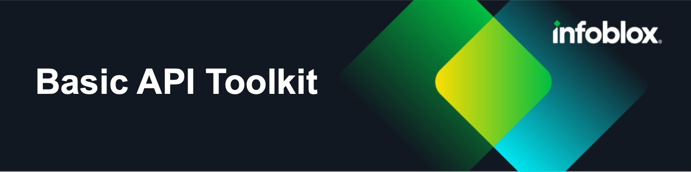

# ibx-tools

A collection of basic tools and functions used by other integrations in the Infoblox environment.

# Table of Contents

# Base Toolkit

## NIOS API Functions
* wapi
* fileop
* services

## Logger functions

* init_logger
* init_console_logger
* increase_log_level
* set_log_level

## utilities functions
* named_checkconf
* named_compilezone

## Scripts Folder

